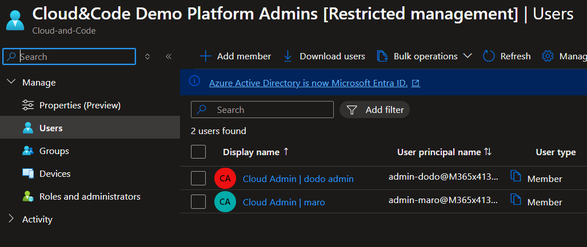
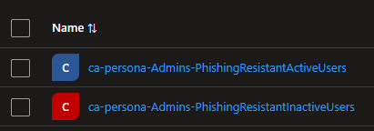
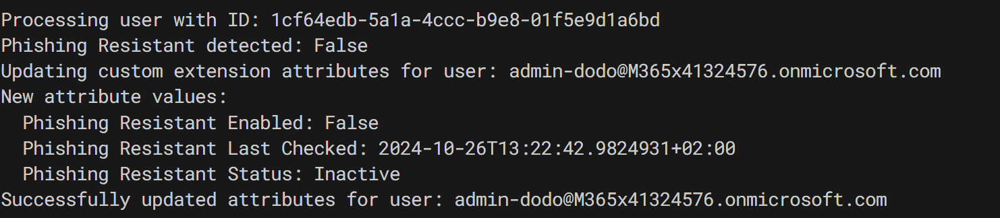

## How to Secure Admin Access - Part 3: Onboarding Phishing-Resistant Policies with Automation 🛡️✨

Hello again, fellow IT wizards 🧙‍♂️🧙‍♀️! Welcome back to our magical journey of securing admin access. Today, we’re diving into the exciting world of **automation** to strengthen our defenses against phishing attacks.

### 📰 Breaking News: Passkeys Are Here!

**Passkeys are now generally available in Entra ID!** 🎉 This is fantastic news for all of us seeking to boost security and streamline our workflows. 🚀🔐

### 🔍 Quick Recap of Our Adventure

- In **Part 1**, we ventured into the realms of **Admin Access**, laying the foundation for a secure kingdom. 🏰  
- In **Part 2**, we conjured **Persona-Based Conditional Access Policies**—customized enchantments 🧙‍♂️🔮 for different roles within your organization.  

Today, we’re taking it a step further by automating the onboarding and offboarding of admin phishing-resistant MFA using **PowerShell** and an **Azure Automation Account**.

---

### Why Is This a Game-Changer? 🤔

🔒 **Security:** Passkeys eliminate the risks of weak or reused passwords. Being tied to devices, they are much harder to compromise.  
⏱️ **Speed:** Say goodbye to mistyped passwords and forgotten credentials. Passkeys get you in with just a tap or glance.  
🌟 **Success Rate:** Passkeys have a **98% sign-in success rate**, which is **3x higher than passwords**.

### 🚀 Embrace the Future of Authentication

By adopting passkeys, you’ll not only enhance security but also drastically reduce the risk of phishing and AiTM (Adversary-in-the-Middle) attacks. It’s a win-win for security and productivity! 🛡️✨

---

### Ready to Dive In? 💡

Here are some helpful resources to kickstart your journey:  
- [Joy’s Blog on Identity Innovations](https://techcommunity.microsoft.com/blog/identity/ignite-ai-and-sase-innovations-in-microsoft-entra/2747278)  
- [Intro Video on Passkeys](https://www.youtube.com/watch?v=zxf75zF91dY)  
- [How to Configure Passkeys](https://www.youtube.com/watch?v=jIZBP7tG5I8)  
- [Updated Documentation](https://learn.microsoft.com/en-gb/entra/identity/authentication/how-to-enable-authenticator-passkey)


### 🧙‍♂️ ScubaGear Recommends Enforcing It for All Users 🔮

If you’re looking for a benchmark in security, **ScubaGear** strongly recommends enforcing phishing-resistant MFA for all users. According to their baseline policy, this is a **must-have** for any organization serious about cybersecurity:

[ScubaGear Baseline Policy](https://github.com/cisagov/ScubaGear/blob/main/PowerShell/ScubaGear/baselines/aad.md#msaad31v1)

#### Policy: MS.AAD.3.1v1
- **Requirement:** Phishing-resistant MFA SHALL be enforced for all users.  
- **Recommended Methods:**
  - Microsoft Entra ID Certificate-Based Authentication (CBA)
  - FIDO2 Security Keys
  - Windows Hello for Business

These methods minimize vulnerabilities by offering MFA with the least weaknesses. Weak forms of MFA simply don’t stand a chance against sophisticated phishing attacks.

---

### 📜 Why This Matters

**Rationale:**  
Weaker forms of MFA fail to protect against advanced phishing strategies. Enforcing phishing-resistant methods dramatically reduces these risks.

**Policy Updates:**  
- _Last Modified:_ June 2023  
- _Criticality:_ SHALL  

**Mapped Threats (MITRE ATT&CK):**
- [T1566: Phishing](https://attack.mitre.org/techniques/T1566/)  
  - [T1566.001: Spearphishing Attachment](https://attack.mitre.org/techniques/T1566/001/)  
  - [T1566.002: Spearphishing Link](https://attack.mitre.org/techniques/T1566/002/)  

---

### 🤔 But What About Resource Tenants?

Here’s where it gets tricky:  
The [Microsoft Docs guide](https://learn.microsoft.com/en-us/entra/identity/authentication/how-to-deploy-phishing-resistant-passwordless-authentication#onboarding-step-1-identity-verification) on deploying phishing-resistant passwordless authentication highlights some critical prerequisites:

- **Compliant Devices:** You need **Windows Hello for Business** or similar compliant devices to register passkeys in the Authenticator app.
- **Conditional Access Setup Challenges:** The **first-time MFA wizard** cannot configure passkeys if the phishing-resistant Conditional Access policy targets persona-based groups containing all administrators.

This limitation often results in frustrating errors when attempting to onboard users into phishing-resistant MFA:

  
  


---

### 💡 Key Takeaway

While ScubaGear’s recommendation is clear, ensuring your **resource tenants** meet all prerequisites for phishing-resistant MFA requires thoughtful planning. Stay tuned as we explore how to automate this process and overcome these challenges in the next sections. 🛡️✨


# But There Is a Solution! Let’s Automate the Onboarding and Offboarding of Admin Phishing-Resistant MFA with PowerShell! 🧙‍♂️✨

Fear not, fellow IT wizards! We have automation magic at our disposal. Here’s the plan to streamline the onboarding and offboarding process for admins using **phishing-resistant MFA**.

### 🪄 The Automation Approach

1. **Custom Attributes:** Create attributes for users and populate them with the correct MFA-related values.  
2. **Dynamic Groups:** Use these attributes to build dynamic groups, enabling targeted Conditional Access policies.  
3. **Azure Automation Account:** Output a script that regularly updates users’ MFA settings, ensuring everything stays current.  

---

### Step 1: Setting the Baseline

Before diving into the script, we need to establish a solid foundation using **Administrative Units (AUs)**. Admin accounts should belong to **Restricted Management AUs**. This ensures that Entra ID roles apply to these accounts in isolation, keeping them secure and separate from tenant-level roles.

#### Why Restricted Management AUs?  
This setup provides:
- Scoped management of admin accounts.
- Reduced exposure to tenant-wide permissions.
- fine-grained control over Entra ID roles.

#### Script Links:
- [Create-CaPasskeyBaseline - GitHub](https://github.com/Dikkekip/dikkekip.github.io/blob/main/scripts/2024-07-29-SecuringAdminAccess/Create-PhisingCheck.ps1)  
- [Create-CaPasskeyBaseline - RAW](https://raw.githubusercontent.com/Dikkekip/dikkekip.github.io/main/scripts/2024-07-29-SecuringAdminAccess/Create-PhisingCheck.ps1)  

---

> **Note:** The script is quite large, so you’ll find the full version at the links above. Below, I’ll showcase key snippets.

---

### Provisioning Administrative Units

Here’s how you can create and assign roles to an AU:

```powershell
# Connect to Microsoft Graph
Connect-ToMicrosoftGraph -Scopes $requiredScopes

Write-Host "[INFO] Starting to provision Administrative Units and assign roles..." -ForegroundColor Cyan
$administrativeUnit = Add-GetCreateAU -Name "$tenantName Platform Admins" -Description "Administrative Unit for $tenantName Platform Admins"

# Add members to the AU
Add-MembersToAU -AUId $administrativeUnit.Id
```
This script creates an Administrative Unit specifically for platform admins and assigns members to it.


## 📚 Step 2: Creating Custom Attributes

To make Conditional Access policies truly effective, we need to add **custom attributes** to our users. Why? Because Conditional Access can only target **Users** and **Groups**; it doesn’t inherently know the specific MFA options registered for each user.

### A Word from the Expert: Stian Andresen Strysse 🌟

As [Stian Andresen Strysse](https://no.linkedin.com/in/stianstrysse) highlights in his detailed [blog post on Custom Security Attributes](https://learningbydoing.cloud/blog/getting-started-with-custom-security-attributes-in-azuread/), **Custom Security Attributes** are a powerful option. Unfortunately, they currently don’t allow creating **Dynamic Entra ID Groups** based on attribute values.

To work around this limitation, we turn to [Custom Extension Attributes](https://learningbydoing.cloud/blog/getting-started-with-azuread-extension-attributes/), which Stian also covers in a separate blog. These attributes provide the flexibility we need to dynamically group users and enforce Conditional Access policies.

---

### The Plan: Leveraging Custom Extension Attributes

Now that we’ve established the need for **Custom Extension Attributes**, here’s how we’ll implement them:

1. **Register an Application in Entra ID.**  
   This step creates a container for our custom attributes.  
2. **Add Attributes to the Application.**  
   By associating these attributes with the app, they become available on user objects.
3. **Target Users Dynamically.**  
   Use these attributes to create dynamic groups, enabling precise Conditional Access policies.

---

### Scripts for Implementation

The full script to set up custom attributes is quite extensive, so I’ve linked it here for reference:  

- [Create-CaPasskeyBaseline - GitHub](https://github.com/Dikkekip/dikkekip.github.io/blob/main/scripts/2024-07-29-SecuringAdminAccess/Create-PhisingCheck.ps1)  
- [Create-CaPasskeyBaseline - RAW](https://raw.githubusercontent.com/Dikkekip/dikkekip.github.io/main/scripts/2024-07-29-SecuringAdminAccess/Create-PhisingCheck.ps1)  

---

<!-- markdownlint-capture -->
<!-- markdownlint-disable -->
> **Note**: Due to the script's length, please refer to the script at the provided link.
{: .prompt-info }
<!-- markdownlint-restore --> Due to the script's length, please refer to the script at the provided link.

```powershell
# Define app registration properties
Write-Host "[INFO] Checking app registration for Custom Attribute Manament..." -ForegroundColor Cyan
$app = Get-MgApplication -Filter "displayName eq '$appDisplayName'" -ErrorAction SilentlyContinue 
if (!$app) {
    write-host "[INFO] Creating app registration for Custom Attribute Manament..." -ForegroundColor Cyan
    $app = New-MgApplication -DisplayName $appDisplayName -SignInAudience "AzureADMyOrg"
    $servicePrincipal = New-MgServicePrincipal -AppId $app.AppId
}

# Output the app registration details
Write-Host "[INFO] $app registration created successfully." -ForegroundColor Green


# Create custom extension properties
Write-Host "[INFO] Creating custom extension properties for phishing-resistant status..." -ForegroundColor Cyan
$enabledAttr = Get-IAMExtensionProperty -Application $app -Name 'phishingResistantEnabled' -DataType 'Boolean'
$lastCheckedAttr = Get-IAMExtensionProperty -Application $app -Name 'phishingResistantLastChecked' -DataType 'DateTime'
$statusAttr = Get-IAMExtensionProperty -Application $app -Name 'phishingResistantStatus' -DataType 'String'
Write-Host "[INFO] Custom extension properties created successfully." -ForegroundColor Green

# Get-MgApplicationExtensionProperty -ApplicationId $app | select Name,DataType
```

Now we can find the three custom attributes created on the application object in the Entra ID tenant:  
[](/assets/img/SecuringAdminAccess/extension-attributes.png)

---

## 📚 Checking User MFA Values and Populating Attributes

With the custom attributes now in place, the next step is to populate them with the correct values for each user. This will allow Conditional Access policies to dynamically target users based on their MFA settings.

---

### The Least Privilege Challenge

To follow the **least privilege principle**, the ideal solution would involve creating a **custom role** with read-only access to user MFA settings. Unfortunately, there’s a catch:  
Custom roles don’t currently support the `microsoft.directory/users/authenticationMethods/standard/privilegedRead` permission, which is necessary for this task.

As a workaround, we assign **standard roles** to the Administrative Unit (AU). These roles include the permissions required to access MFA settings. While not as granular as we’d like, it gets the job done.

---

### Script: Creating the AU and Assigning Roles

Here’s how to create the AU and assign roles to it:
```powershell
Write-Host "[INFO] Starting to provision Administrative Units and assign roles..." -ForegroundColor Cyan
$administrativeUnit = Add-GetCreateAU -Name "$tenantName Platform Admins" -Description "Administrative Unit for $tenantName Platform Admins"

write-host "[INFO] Adding members to the Administrative Unit..." -ForegroundColor Cyan
Add-MembersToAU -AUId $administrativeUnit.Id

$adminUserName = Get-MgContext | Select-Object -ExpandProperty Account
$adminUser = Get-MgUser -Filter "userPrincipalName eq '$adminUserName'" -ErrorAction SilentlyContinue
write-host "[INFO] Assigning roles to $adminUserName in $administrativeUnit..." -ForegroundColor Cyan
Add-RoleAssignentToAU -PrincipalId $adminUser.Id -roleName "User Administrator" -adminUnit $administrativeUnit -AssignmentType "Eligible"
Write-Host "[INFO] User Administrator role assigned to $adminUserName in $administrativeUnit." -ForegroundColor Green
Add-RoleAssignentToAU -PrincipalId $adminUser.Id -roleName "Privileged Authentication Administrator" -adminUnit $administrativeUnit -AssignmentType "Eligible"
Write-Host "[INFO] Privileged Authentication Administrator role assigned to $adminUserName in $administrativeUnit." -ForegroundColor Green

```


### Exploring the Option of a Custom Role for Reading MFA Settings

While assigning standard roles to the Administrative Unit (AU) gets the job done, a **custom role** with read-only access to user MFA settings would be a more elegant and least-privileged solution. This would allow us to securely manage non-administrative or privileged users without granting broader permissions.

#### The Challenge

Unfortunately, while attempting this approach, I encountered a limitation:  
The permission `microsoft.directory/users/authenticationMethods/standard/privilegedRead`—necessary for accessing MFA settings—cannot currently be assigned through custom roles for admin accounts. While this method works for non-administrators, it falls short when applied to privileged users.

---

### The Ideal Script (If It Worked)

If the custom role approach worked as expected, here’s the script I would use to create and assign it:

#### Script Links:
- [Create-CaPasskeyBaseline - GitHub](https://github.com/Dikkekip/dikkekip.github.io/blob/main/scripts/2024-07-29-SecuringAdminAccess/Create-CAPasskey-PhisingCheck.ps1)  
- [Create-CaPasskeyBaseline - RAW](https://raw.githubusercontent.com/Dikkekip/dikkekip.github.io/main/scripts/2024-07-29-SecuringAdminAccess/Create-CAPasskey-PhisingCheck.ps1)

---

<!-- markdownlint-capture -->
<!-- markdownlint-disable -->
> **Note**: Due to the script's length, please refer to the script at the provided link.
{: .prompt-info }
<!-- markdownlint-restore --> Due to the script's length, please refer to the script at the provided link.

```powershell
# Define parameters
param(
    [string]$DisplayName = "Authentication Method Reader",
    [string]$Description = "Read-only access to user authentication methods",
    [string]$PrincipalUserUPN = "admin-dodo@M365x4.onmicrosoft.com",  # Replace with your user UPN
    [string]$PrincipalSPNId = "",       # Replace with your service principal ID
    [string]$AdminUnitDisplayName = "Cloud-and-Code Platform Admins"         # Replace with your administrative unit name
)

# Connect to Microsoft Graph
Connect-MgGraph -Scopes "Directory.ReadWrite.All", "RoleManagement.ReadWrite.Directory", "AdministrativeUnit.ReadWrite.All"


# Main script execution
try {
    # Set of permissions to grant
    $allowedResourceActions = @(
        "microsoft.directory/users/authenticationMethods.email/standard/read",
        "microsoft.directory/users/authenticationMethods.fido2/standard/read",
        "microsoft.directory/users/authenticationMethods.microsoftAuthenticator/standard/read",
        "microsoft.directory/users/authenticationMethods.password/standard/read",
        "microsoft.directory/users/authenticationMethods.passwordlessMicrosoftAuthenticator/standard/read",
        "microsoft.directory/users/authenticationMethods.securityQuestion/standard/read",
        "microsoft.directory/users/authenticationMethods.sms/standard/read",
        "microsoft.directory/users/authenticationMethods.softwareOath/standard/read",
        "microsoft.directory/users/authenticationMethods.temporaryAccessPass/standard/read",
        "microsoft.directory/users/authenticationMethods.voice/standard/read",
        "microsoft.directory/users/authenticationMethods/standard/read"
        # Note: "microsoft.directory/users/authenticationMethods/standard/privilegedRead" cannot be assigned in custom roles
    )

    $rolePermissions = @(
        @{
            AllowedResourceActions = $allowedResourceActions
        }
    )

    # Generate a template ID
    $templateId = (New-Guid).Guid

    # Check if role already exists
    $existingRole = Get-RoleDefinition -RoleName $DisplayName

    if ($existingRole) {
        Write-Host "Role '$DisplayName' already exists."

        # Extract existing allowed actions
        $existingAllowedActions = @()
        foreach ($permission in $existingRole.RolePermissions) {
            $existingAllowedActions += $permission.AllowedResourceActions
        }

        # Compare permissions
        $permissionsChanged = $false

        if (@(Compare-Object -ReferenceObject $existingAllowedActions -DifferenceObject $allowedResourceActions -IncludeEqual | Where-Object { $_.SideIndicator -ne '==' }).Count -gt 0) {
            $permissionsChanged = $true
        }

        if ($permissionsChanged) {
            Write-Host "Permissions have changed. Updating role..."
            Update-CustomRole -RoleDefinitionId $existingRole.Id -RolePermissions $rolePermissions -Description $Description
            Write-Host "Role '$DisplayName' has been updated."
        } else {
            Write-Host "Permissions have not changed. No update required."
        }
    } else {
        Write-Host "Role '$DisplayName' does not exist. Creating new role..."
        $customRole = Create-CustomRole -DisplayName $DisplayName -Description $Description -RolePermissions $rolePermissions -TemplateId $templateId
        Write-Host "Role '$DisplayName' has been created."
        $existingRole = $customRole  # Assign for later use
    }

    # Get the role definition ID
    $roleDefinitionId = $existingRole.Id

    # Get the Administrative Unit
    $adminUnit = Get-MgDirectoryAdministrativeUnit -Filter "displayName eq '$AdminUnitDisplayName'"
    if (-not $adminUnit) {
        Write-Error "Administrative Unit '$AdminUnitDisplayName' not found."
        return
    }
    $directoryScopeId = "/administrativeUnits/$($adminUnit.Id)"

    # Get the user
    $user = Get-MgUser -Filter "userPrincipalName eq '$PrincipalUserUPN'"
    if (-not $user) {
        Write-Error "User '$PrincipalUserUPN' not found."
    } else {
        $principalUserId = $user.Id
        # Assign role to user
        Assign-Role -PrincipalId $principalUserId -RoleDefinitionId $roleDefinitionId -DirectoryScopeId $directoryScopeId
    }

    # Get the service principal
    $spn = Get-MgServicePrincipal -ServicePrincipalId $PrincipalSPNId
    if (-not $spn) {
        Write-Error "Service Principal with ID '$PrincipalSPNId' not found."
    } else {
        $principalSPNId = $spn.Id
        # Assign role to service principal
        Assign-Role -PrincipalId $principalSPNId -RoleDefinitionId $roleDefinitionId -DirectoryScopeId $directoryScopeId
    }
}
catch {
    Write-Error "An error occurred: $_"
}
finally {
    # Disconnect from Microsoft Graph
    Disconnect-MgGraph
}
```


## Updating the Users' Attributes to Include the MFA Settings

With the custom attributes and Administrative Unit in place, the next step is to update user attributes with their MFA settings. This allows Conditional Access policies to dynamically target users based on their MFA configurations.

---

### Creating Dynamic Entra ID Groups

The first step in this process is creating **Dynamic Entra ID Groups**. These groups will be based on the custom attributes we created earlier and allow us to segregate users based on their MFA readiness or status.  

Here’s an example of what your dynamic groups might look like:  



```powershell

# Clean the application AppId (client ID) by removing hyphens
write-host "[INFO] setting Application Attributes dynamic group..." -ForegroundColor Cyan
$applicationId = $app.AppId -replace '-', ''
$extensionAttribute = "extension_$applicationId`_phishingResistantStatus"
$inactiveMembershipRule = '(user.' + $extensionAttribute + ' -eq "Inactive") and (user.userType -eq "Member") and (user.userPrincipalName -match "admin") and (user.department -match "Cloud Admins")'


$activeMembershipRule = '(user.' + $extensionAttribute + ' -eq "Active") and (user.userType -eq "Member") and (user.userPrincipalName -match "admin") and (user.department -match "Cloud Admins")'


# Retrieve or create the dynamic groups
Write-Host "[INFO] Creating dynamic groups for phishing-resistant status..." -ForegroundColor Cyan
$inactiveGroup = Get-IAMDynamicGroup -DisplayName 'ca-persona-admins-phishingResistantInactiveUsers' -MembershipRule $inactiveMembershipRule -Verbose
$activeGroup = Get-IAMDynamicGroup -DisplayName 'ca-persona-admins-phishingResistantActiveUsers' -MembershipRule $activeMembershipRule -Verbose


```
### Updating Users’ Attributes with MFA Settings

Once the dynamic groups are created, the next step is to update the users' custom attributes with their MFA settings. This ensures that users are correctly categorized, allowing the **Dynamic Entra ID Groups** to work seamlessly with Conditional Access policies.

Here’s an example of the updated MFA settings for users:  


```powershell

# Output the selected user's principal name for verification
Write-Output "Test user: $($testUser.UserPrincipalName)"

# Ensure that the PIM role is active for the specified AU
$userAuth = New-EligibeRoleActivationForAU -adminUnit $administrativeUnit -roleName "User Administrator" -UserObjectId $adminUser.Id
$mfaAuth = New-EligibeRoleActivationForAU -adminUnit $administrativeUnit -roleName "Privileged Authentication Administrator" -UserObjectId $adminUser.Id
if ($userAuth -and $mfaAuth) {
    $success = $true
}
if (-not $success) {
    Write-Host "❌ Failed to activate the required roles for the specified AU. Exiting script." -ForegroundColor Red
    return
}
else {
    Update-IAMPhishingResistantStatus -Object $testUser -ObjectType 'User' `
        -PhishingResistantEnabledAttr $enabledAttr `
        -PhishingResistantLastCheckedAttr $lastCheckedAttr `
        -PhishingResistantStatusAttr $statusAttr
}
# Update phishing-resistant status for the selected user


# Update phishing-resistant status
Write-Host "[INFO] Updating phishing-resistant status for the selected user..." -ForegroundColor Cyan
$selectedGroups = Get-MgGroup -All | Out-ConsoleGridView -OutputMode Multiple -Title "Select the admin group"
Update-IAMPhishingResistantStatus -Object $selectedGroups[0] -ObjectType "Group" -PhishingResistantEnabledAttr $enabledAttr -PhishingResistantLastCheckedAttr $lastCheckedAttr -PhishingResistantStatusAttr $statusAttr
```

### Automating the Update Process for User Attributes

Once the system checks the users' settings, it will automatically update their custom attributes to reflect their MFA configurations. This process ensures that the attributes are always accurate and up to date.

---

### Visualizing the Changes

1. **Updated Attributes:**  
   After the check, you’ll see the updated custom attributes for the users:  
   

2. **Dynamic Group Updates:**  
   As the attributes are updated, users will be dynamically assigned to the appropriate groups:  
   

```powershell

function New-IAMhourlyCheckerScript {
    [CmdletBinding()]
    param (
        [Parameter(Mandatory = $true)]
        [ValidateNotNullOrEmpty()]
        [string]$AppId,

        [Parameter(Mandatory = $true)]
        [ValidateNotNullOrEmpty()]
        [string]$PhishingResistantEnabledAttr,

        [Parameter(Mandatory = $true)]
        [ValidateNotNullOrEmpty()]
        [string]$PhishingResistantLastCheckedAttr,

        [Parameter(Mandatory = $true)]
        [ValidateNotNullOrEmpty()]
        [string]$PhishingResistantStatusAttr,

        [Parameter(Mandatory = $true)]
        [ValidateNotNullOrEmpty()]
        [PSCustomObject[]]$Groups,

        [Parameter(Mandatory = $false)]
        [string]$OutputPath = (Join-Path -Path (Get-Location) -ChildPath 'hourlyCheckerScript.ps1')
    )

    try {
        # Convert groups array to a string representation
        $groupsArrayString = $Groups | ForEach-Object {
            "        @{ Id = '$($_.Id)'; Name = '$($_.DisplayName)' }"
        } | Join-String -Separator ",`n"

        $hourlyCheckerScriptContent = @""
    }
}
# Output the script content
```
### Creating the Automation Account

Once you’ve generated the script, it’s time to set up an **Azure Automation Account** to execute the updates on a regular basis. This ensures that users’ MFA settings are always current and dynamically aligned with Conditional Access policies.

---

### How to Set It Up

1. **Locate the Script:**  
   You can find the script in the directory where you ran the previous steps. This script is designed to:
   - Update users’ MFA settings.
   - Ensure that attributes remain accurate and synced with group memberships.

2. **Import the Script into an Automation Account:**  
   - Create an Azure Automation Account.
   - Upload the script as a **Runbook**.
   - Schedule it to run at regular intervals (e.g., hourly or daily).

3. **Configure Permissions:**  
   Assign the **System Assigned Identity** of the Automation Account the correct permissions to:
   - Read user MFA settings.
   - Update attributes in the Entra ID tenant.

---

### Script for Setting Up the Automation Account

You can use the following script to create an Automation Account with the required modules pre-installed:

- [Create-CAPasskey-AutomationAccount - GitHub](https://github.com/Dikkekip/dikkekip.github.io/blob/main/scripts/2024-07-29-SecuringAdminAccess/Create-CAPasskey-AutomationAccount.ps1)  
- [Create-CAPasskey-AutomationAccount - RAW](https://raw.githubusercontent.com/Dikkekip/dikkekip.github.io/main/scripts/2024-07-29-SecuringAdminAccess/Create-CAPasskey-AutomationAccount.ps1)

---
<!-- markdownlint-capture -->
<!-- markdownlint-disable -->
> **Note**: Due to the script's length, please refer to the script at the provided link.
{: .prompt-info }
<!-- markdownlint-restore --> Due to the script's length, please refer to the script at the provided link.

### Assigning Roles to the Automation Account Identity

Before automating the updates, ensure the **System Assigned Identity** of the Automation Account has the required permissions. Assign the necessary roles to the Administrative Unit (AU) for the automation account to manage user MFA settings effectively:

```powershell
# Activate roles for the Automation Account's System Assigned Identity
$userAuth = New-EligibeRoleActivationForAU -adminUnit $administrativeUnit -roleName "User Administrator" -UserObjectId "System Assigned Identity ID here"
$mfaAuth = New-EligibeRoleActivationForAU -adminUnit $administrativeUnit -roleName "Privileged Authentication Administrator" -UserObjectId "System Assigned Identity ID here"
```

## Creating Conditional Access Policies
The final step is to create the Conditional Access Policies that will enforce phishing-resistant MFA. This involves:

Creating an Authentication Strength Policy:
This defines the authentication methods allowed, such as FIDO2 or Temporary Access Pass (TAP).
Targeting Dynamic Groups:
Use the dynamic groups created earlier to apply policies to users based on their attributes.


### Step 1: Creating the Authentication Strength Policy
The following script creates an Authentication Strength policy tailored for first-time use with phishing-resistant methods:

```powershell

# Define the Authentication Strength policy
$authStrengthParams = @{
    Name = "Phishing-resistant-firsttimeUse"
    Description = "Authentication strength for first-time use with phishing-resistant methods"
    AllowedCombinations = @(
        "fido2", 
        "windowsHelloForBusiness", 
        "x509CertificateMultiFactor", 
        "temporaryAccessPassOneTime"
    )
}
$authStrength = New-AuthenticationStrength @authStrengthParams
Write-Host "Authentication Strength created: $($authStrength.DisplayName)"
```

### Step 2: Creating Conditional Access Policies
Once the Authentication Strength Policy is ready, you can create Conditional Access Policies to enforce it. These policies will apply to users in the dynamic groups:

```powershell


$caPolicy1Params = @{
    DisplayName   = "CA109-Admins-BaseProtection-AllApps-AnyPlatform-PhishingResistant"
    State         = "disabled"
    Conditions    = @{
        ClientAppTypes = @("all")
        Applications   = @{ IncludeApplications = @("All") }
        Users          = @{
            IncludeGroups = @("ca-Persona--Admins")
            ExcludeGroups = @(
                "ca-BreakGlassAccounts",
                "ca-Persona-Admins-BaseProtection-Exclusions",
                "ca-Persona-Microsoft365ServiceAccounts",
                "ca-Persona-AzureServiceAccounts",
                "ca-Persona-CorpServiceAccounts",
                "ca-Persona-admins-PhishingResistant-Exclusions"
            )
        }
    }
    GrantControls = @{
        operator               = "AND"
        builtInControls        = @()
        authenticationStrength = @{ id = "00000000-0000-0000-0000-000000000004" }
    }
}
New-ConditionalAccessPolicies -Params $caPolicy1Params

$caPolicy2Params = @{
    DisplayName   = "CA110-Admins-BaseProtection-AllApps-AnyPlatform-TapFirstTimeUse"
    State         = "disabled"
    Conditions    = @{
        ClientAppTypes = @("all")
        Applications   = @{ IncludeApplications = @("All") }
        Users          = @{
            IncludeGroups = @("ca-Persona--Admins")
            ExcludeGroups = @(
                "ca-BreakGlassAccounts",
                "ca-Persona-Admins-BaseProtection-Exclusions",
                "ca-Persona-Microsoft365ServiceAccounts",
                "ca-Persona-AzureServiceAccounts",
                "ca-Persona-CorpServiceAccounts",
                "ca-Persona-admins-PhishingResistant-Inclusions"
            )
        }
    }
    GrantControls = @{
        operator               = "AND"
        builtInControls        = @()
        authenticationStrength = @{ id = $authStrength.Id }
    }
}
New-ConditionalAccessPolicies -Params $caPolicy2Params

```

# Final Thoughts
With the Automation Account, Authentication Strength Policy, and Conditional Access Policies in place, your environment is now equipped to enforce phishing-resistant MFA dynamically and at scale. This setup ensures a secure, efficient, and automated approach to managing admin access.

Happy automating! 🚀✨

Hope you enjoyed this deep dive into securing your admins with phishing-resistant MFA. Peace out, Maarten 🧙‍♂️✨